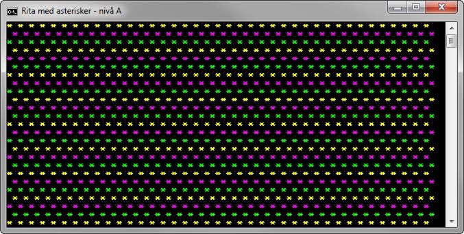

1.2 Rita med asterisker (A-, B-, och C-nivå)
============================================
[1-2-rita-med-asterisker.pdf](https://github.com/1dv402/kursmaterial/raw/master/Laborationsuppgifter/1-2-rita-med-asterisker.pdf)

"Skriv ett program som endast använder följande satser, en gång vardera, för utskrift

```csharp
Console.Write(" ");
Console.Write("* ");
Console.WriteLine();
```

för att skapa ett mönster med 39 kolumner och 25 rader enligt figuren..."


